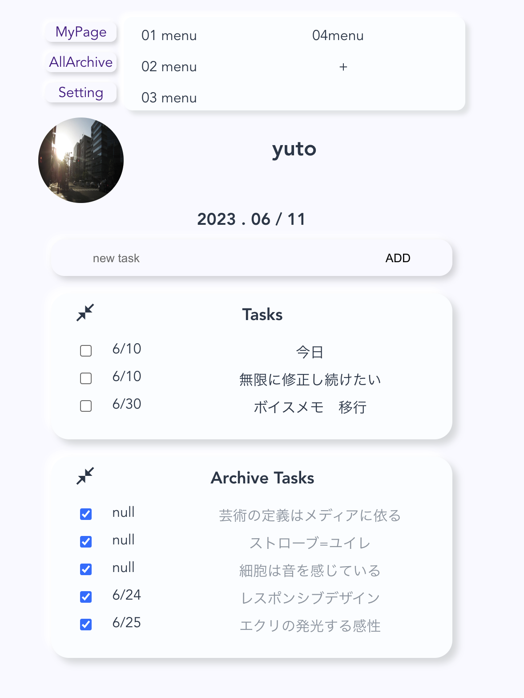
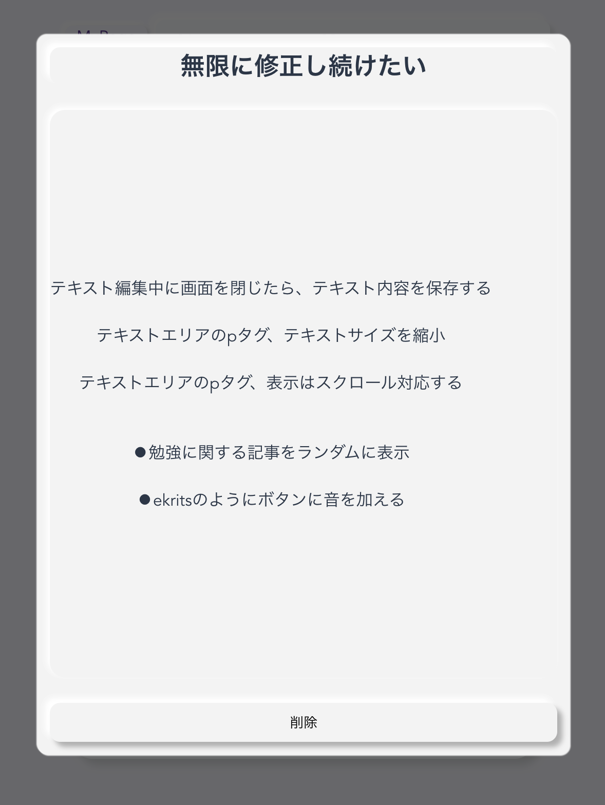
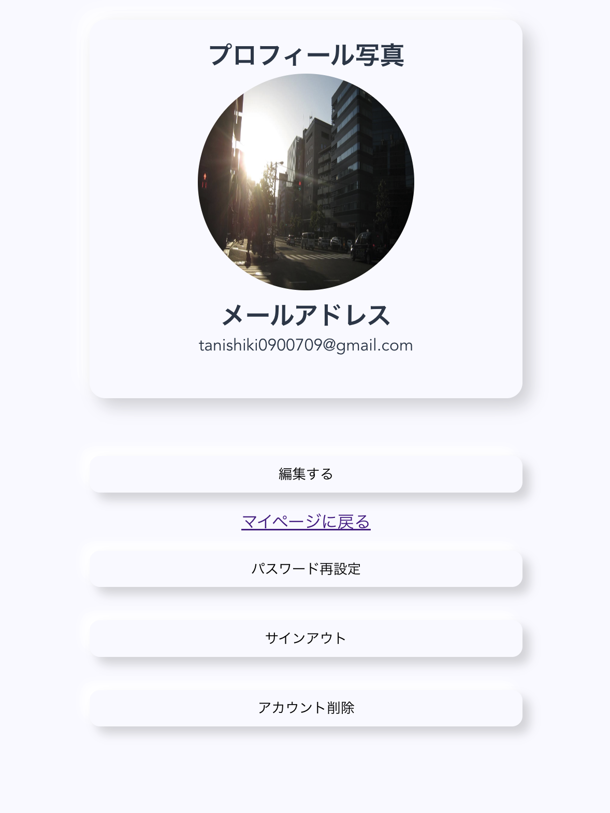

# タスク管理アプリ
このプロジェクトはFirebaseとVue.jsを使用したタスク管理アプリです。
タスクの作成、編集、削除が行え、その進捗を一覧できます。
「開きたくなるような勉強用メモアプリを作って欲しい」という妹の要望により、ニューモフィズムデザインを採用し、すべてのテキスト要素にメモを記述できるようモーダルに対応しています。
”開きたくなる”デザインだけでは実際に開いてもらうには難しいと思い、操作音をSNDライブラリを用いて実装しました。

## サイトURL
[task-app-64bfb.web.app](https://task-app-64bfb.web.app/?#/SignIn)

## 使用技術
### Firebase
〈hosting〉
〈firebase database〉
〈authentication〉
〈storage〉

### Vue.js
〈vuex〉
〈vue router〉
〈axios〉

## 主な機能
タスクの作成、編集、削除
タスク,アーカイブの表示,非表示
タスクの進捗状況の可視化
サブメニューの作成、編集、削除
ユーザー情報の編集、削除
パスワード再設定

## スクリーンショット




## インストール
```
# リポジトリをクローン
git clone https://

# ディレクトリに移動
cd naho-task-app

# 必要な依存関係をインストール
npm install

# ローカルサーバを立ち上げ
npm run serve
```

## 連絡先
質問やフィードバックがある場合は、以下のメールアドレスまでご連絡ください: tanishiki0900709@gmail.com
